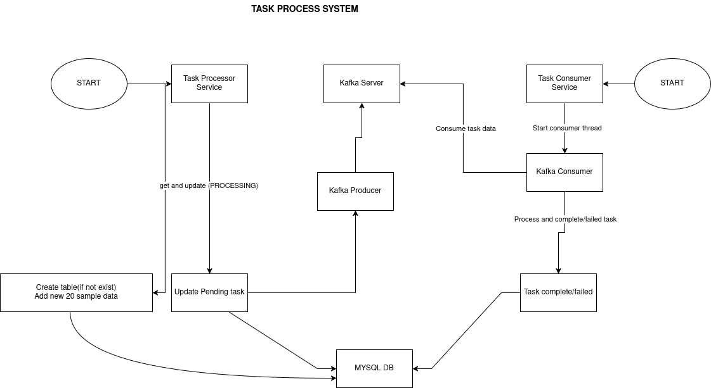

## task-process-system
### Service to process related operations 

### Basic setup requirements

1. DB: MYSQL
2. MESSAGE QUEUING:  KAFKA_SERVER
3. gRPC/proto
4. System setup with conda environment so some packages are best work install with conda. 
Note: Here, I write proto in both services, generally I create common proto directory and install generated proto in environment.


### install requirements
``` python
pip install -r  requirements.txt
```

### generate proto
``` bash
chmod +x generate_proto.sh
```

``` python
bash generate_proto.sh
```

### Start task systems
```bash
sh start_service.sh
```

### Start task consumer systems
```bash
sh start_service.sh
```

### System Architecture 



